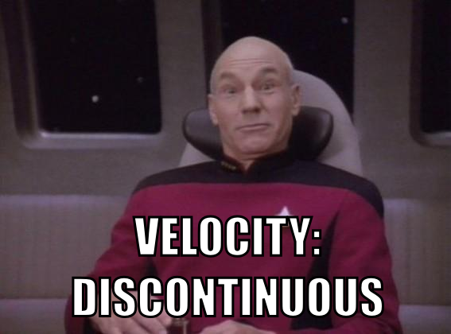

## Steel strain interpolation


```{r include=FALSE}
load("custom/trained.RO")
x.gap.surface <- GriddedConvexHull(X=d.gap$X, spacing=0.2)
post.gap <- M.aniso$PosteriorInterval(d=d.strain, X.out=x.gap.surface, num.sd=3)
M.aniso$SetNoiseBounds(sigma.vals=2e-6)
L.strain <- M.aniso$L(d=d.strain, X.out=x.gap.surface)
n.draws <- 20
set.seed(1)
random.draws <- L.strain %*% matrix(rnorm(nrow(L.strain) * n.draws), ncol=n.draws)
```

```{r strain-datapoints, webgl=TRUE, fig.height=4}
d.strain$Plot2D(dist.factor=0.15, max.points=Inf, Y.scale=500)
```

Automotive application: stronger, lighter steels

  - **Goal**: relate *stress* and *strain* at **same point** on material
  - **Problem**: measurements are incompatible!
  - **Solution**: measure surroundings; infer in the gap

<aside>Collaboration with Adam Creuziger and Mark Iadicola at NIST</aside>

---

## Use intervals?

```{r fig.height=7, webgl=TRUE}
d.strain$Plot2D(dist.factor=0.15, max.points=Inf, Y.scale=500)
PlotSurface(X=x.gap.surface, Y=post.gap$mean)
PlotSurface(X=x.gap.surface, Y=post.gap$upper, color='blue', alpha=0.3)
PlotSurface(X=x.gap.surface, Y=post.gap$lower, color='red', alpha=0.3)
```

```{r include=FALSE}
# Clean up (will this make it run faster?)
rgl.close()
rm(M.aniso)
gc()
```

---

## CI Disadvantage:

```{r}
# Create simple model of 2D data to show what we're missing by just giving CI's
set.seed(7)
N <- 20
d.example <- data.frame(x=1:N, y=0.04 * (1:N - 0.5 * N) ^ 2 + rnorm(N))
d.Dataset <- Dataset(id='example', data=d.example, X.names='x', column='y')
m.example <- Model('example')
cov.example <- CovarianceSE(ell.bounds=c(0.1, 50), sigma.f.bounds=c(0.01, 100))
m.example$AddCovariance(cov.example)
m.example$SetNoiseBounds(sigma.vals=1)
m.example$Train(d=d.Dataset)
x.example <- seq(from=1, to=20, length.out=200)
posterior <- m.example$PosteriorInterval(d=d.Dataset, num.sd=3,
  X.out=x.example)
plot.CI <- (ggplot(data=d.example, aes(x=x, y=y))
  + geom_ribbon(data=posterior, aes(x=X, ymin=lower, ymax=upper),
    inherit.aes=FALSE, fill='green', alpha=0.5, colour=NA)
  + geom_line(data=posterior, aes(x=X, y=lower), inherit.aes=FALSE,
    colour='darkgreen')
  + geom_line(data=posterior, aes(x=X, y=upper), inherit.aes=FALSE,
    colour='darkgreen')
  + geom_point()
  )
print(plot.CI)
```

---

## CI Disadvantage:

```{r}
m.crazy <- Model('wiggly')
m.crazy$AddCovariance(cov.example)
m.crazy$SetNoiseBounds(sigma.vals=1e-4)
m.crazy$Train(d=d.Dataset)
crazy.mean <- m.crazy$PosteriorInterval(d=d.Dataset, X.out=x.example)
print(plot.CI
  + geom_line(data=posterior, aes(x=X, y=mean), inherit.aes=FALSE,
    colour='red')
  + geom_line(data=crazy.mean, aes(x=X, y=mean), inherit.aes=FALSE,
    colour='blue')
  )
```

<div class='bigger' style='text-align: center; width: 100%;'>
  Loses <strong>horizontal</strong> information
</div>

---

## Show multiple draws?

```{r fig.height=7, webgl=TRUE}
d.strain$Plot2D(dist.factor=0.15, max.points=Inf, Y.scale=500)
set.seed(1)
my.colors <- sample(colours(), n.draws)
for (i in 1:n.draws) {
  PlotSurface(X=x.gap.surface, Y=post.gap$mean + random.draws[, i], color=my.colors[i])
}
```

```{r include=FALSE}
# Clean up
rgl.close()
```

---

## Show one at a time?


--- .move_image

## Decoupling the Problem

<div style='clear: both;'>
  We can <em>reduce</em> our problem to a <strong>single random variable</strong>.
</div>

```{r makeGifs, include=FALSE}
set.seed(5)
n.frames <- 180  # Number of animation frames in final slide
n.reduce <- 35  # Number of points
x.reduce <- seq(from=0, to=5, length.out=n.reduce)
small.noise <- 1e-6
cov <- CovarianceSE(ell=1, sigma.f=1)
K <- cov$K.specific(X=x.reduce)
L <- t(chol(K + (small.noise ^ 2) * diag(n.reduce)))
y.noisy.animate <- BubblingRandomMatrix(n.pts=n.reduce, N=6, n.times=n.frames)
y.smooth.animate <- L %*% y.noisy.animate
y.noisy <- y.noisy.animate[, 1]
d.reduce <- data.frame(x=x.reduce, y.noisy=y.noisy, y.smooth=L %*% y.noisy)
DataFromMatrix <- function(M) {
  r <- nrow(M)
  c <- ncol(M)
  return (
    data.frame(
      x=rep(1:c, each=r),
      y=r + 1 - rep(1:r, c),
      M=as.vector(M)
      )
    )
}
# Make the animation
title.smooth <- 'f: Smooth function'
title.noisy <- 'n: noisy points'
library(animation)
this.theme <- theme(legend.position='none', text=element_text(size=20),
  axis.text=element_blank(), axis.title=element_blank(),
  axis.line=element_blank(), axis.ticks=element_blank())
MakeGif <- function(name, time.mat, title) {
  saveGIF({
    for (i in 1:n.frames) {
      d.reduce.temp <- data.frame(x=x.reduce, y=time.mat[, i])
      print(ggplot(data=d.reduce.temp, aes(x=x, y=y))
        + geom_point()
        + this.theme
        + ggtitle(title)
        + scale_y_continuous(limits=3*c(-1, 1))
        )
    }
  }, movie.name=sprintf('reduce_%s.gif', name),
  outdir=paste(getwd(), 'custom', sep='/'),
  clean=TRUE, interval=0.05, ani.dev='CairoPNG',
  ani.width=72 * 3.2, ani.height=72 * 3.5)
}
```

```{r actually-make-them, include=FALSE}
MakeGif('noisy', y.noisy.animate, title.noisy)
MakeGif('smooth', y.smooth.animate, title.smooth)
```

```{r fig.width=3.2, fig.height=3.5}
matrix.colours <- scale_fill_gradient2()
p.smooth <- (ggplot(data=d.reduce, aes(x=x))
  + geom_point(aes(y=y.smooth))
  + this.theme
  + ggtitle(title.smooth)
  )
p.K <- (ggplot(data=DataFromMatrix(K), aes(x=x, y=y, fill=M))
  + geom_raster()
  + this.theme
  + matrix.colours
  + ggtitle('K: Covariance Matrix')
  )
p.L <- (ggplot(data=DataFromMatrix(L), aes(x=x, y=y, fill=M))
  + geom_raster()
  + this.theme
  + matrix.colours
  + ggtitle('L: Cholesky(K)')
  )
p.noisy <- (ggplot(data=d.reduce, aes(x=x))
  + geom_point(aes(y=y.noisy))
  + this.theme
  + ggtitle(title.noisy)
  )
print(p.smooth)
```

--- .move_image

## Decoupling the Problem

<div style='clear: both;'>
  We can <em>reduce</em> our problem to a <strong>single random variable</strong>.
</div>

```{r decoupling-2, fig.width=3.2, fig.height=3.5}
print(p.smooth)
print(p.K)
```

--- .move_image

## Decoupling the Problem

<div style='clear: both;'>
  We can <em>reduce</em> our problem to a <strong>single random variable</strong>.
</div>

```{r decoupling-3, fig.width=3.2, fig.height=3.5}
print(p.smooth)
print(p.K)
print(p.L)
```

--- .move_image

## Decoupling the Problem

<div style='clear: both;'>
  We can <em>reduce</em> our problem to a <strong>single random variable</strong>.
</div>

```{r decoupling-4, fig.width=3.2, fig.height=3.5}
print(p.smooth)
print(p.K)
print(p.L)
print(p.noisy)
```

<div class='bigger' style='clear: both; width: 100%; text-align: center;'>
  $$f = Ln$$
</div>

--- .move_image

## Decoupling the Problem

<div style='clear: both;'>
  We can <em>reduce</em> our problem to a <strong>single random variable</strong>.
</div>


```{r fig.width=3.2, fig.height=3.5}
this.theme <- theme(legend.position='none', text=element_text(size=20),
  axis.text=element_blank(), axis.title=element_blank(),
  axis.line=element_blank(), axis.ticks=element_blank())
matrix.colours <- scale_fill_gradient2()
p.smooth <- (ggplot(data=d.reduce, aes(x=x))
  + geom_point(aes(y=y.smooth))
  + this.theme
  + ggtitle('f: Smooth function')
  )
p.K <- (ggplot(data=DataFromMatrix(K), aes(x=x, y=y, fill=M))
  + geom_raster()
  + this.theme
  + matrix.colours
  + ggtitle('K: Covariance Matrix')
  )
p.L <- (ggplot(data=DataFromMatrix(L), aes(x=x, y=y, fill=M))
  + geom_raster()
  + this.theme
  + matrix.colours
  + ggtitle('L: Cholesky(K)')
  )
p.noisy <- (ggplot(data=d.reduce, aes(x=x))
  + geom_point(aes(y=y.noisy))
  + this.theme
  + ggtitle('n: noisy points')
  )
print(p.K)
print(p.L)
```


<div class='bigger' style='clear: both; width: 100%; text-align: center;'>
  $$f(t) = Ln(t)$$
</div>

---

## Caveat: statistics

  <div style='font-size: 2em; text-align: center;'>
    Too easy to mislead...
  </div>

---

## Caveat: statistics (individual points)

```{r}
set.seed(1)
N.frames <- 14
t.frames <- 1:N.frames
Y.data <- rnorm(length(t.frames))
single.points <- geom_point(size=4)
y.timetrace <- scale_y_continuous("", limits=3 * c(-1, 1))
p.base <- (ggplot(data=data.frame(x=t.frames, y=Y.data), aes(x=x, y=y))
  + scale_x_continuous("Time")
  + y.timetrace
  )
print(p.base + single.points)
```

---

## Caveat: statistics (naive interpolation)

```{r}
print(p.base
  + single.points
  + geom_line()
  )
```

---

## Caveat: statistics (entire distribution)

```{r}
pts.per.frame <- 200
new.data <- data.frame(x=t.frames, y=rnorm(pts.per.frame * N.frames),
  label=rep(paste('a', 1:pts.per.frame, sep=''), each=N.frames))
dist.points <- geom_point(data=new.data, colour='grey')
print(p.base
  + dist.points
  + single.points
  + geom_line()
  )
```

---

## Caveat: statistics (interpolated distribution)

```{r}
dist.lines <- geom_line(data=new.data, aes(group=label), colour='grey')
print(p.base
  + dist.points
  + dist.lines
  + single.points
  + geom_line()
  )
```

<div style='font-size: 1.6em; text-align: center;'>
  Statistics <em>between</em> keyframes<br>
  are <strong>clearly different</strong><br>
  from statistics <em>at</em> keyframes
</div>

---

## Solution: connect differently

```{r}
print(p.base
  + single.points
  + geom_line()
  )
```

---

## Solution: connect differently

```{r}
N.out <- 500
t.out <- seq(from=head(t.frames, 1), to=tail(t.frames, 1), length=N.out)
weight <- function(t.in, t.out) {
  ifelse(abs(t.in - t.out) > 1, 0, cos((t.in - t.out) * pi / 2))
}
d.weight <- function(t.in, t.out) {
  ifelse(abs(t.in - t.out) > 1, 0, -0.5 * pi * sin((t.in - t.out) * pi / 2))
}
dd.weight <- function(t.in, t.out) {
  - pi * pi * 0.25 * weight(t.in, t.out)
}
mat.interpolate <- outer(t.out, t.frames, weight)
esg.data <- data.frame(x=t.out, y=mat.interpolate %*% Y.data)
esg.lines <- geom_line(data=esg.data, aes(x=x, y=y))
print(p.base
  + single.points
  + esg.lines
  )
```

---

## Distributions: old connection

```{r}
dist.lines <- geom_line(data=new.data, aes(group=label), colour='grey')
print(p.base
  + dist.points
  + dist.lines
  + single.points
  + geom_line()
  )
```

---

## Distributions: new connection

```{r}
temp.matrix <- matrix(new.data$y, ncol=pts.per.frame)
interp <- mat.interpolate %*% temp.matrix
new.data.lines <- data.frame(x=t.out, y=as.vector(interp),
  label=rep(paste('a', 1:pts.per.frame, sep=''), each=N.out))
esg.dist.lines <- geom_line(data=new.data.lines, colour='grey',
  aes(x=x, y=y, group=label))
p.esg <- (p.base
  + esg.dist.lines
  + single.points
  + esg.lines
  )
print(p.esg)
```
**E**hlschlaeger, **S**hortridge, **G**oodchild (**ESG**)
> - By eye: looks like better statistics
> - By math: easy to prove **same distribution at all times**

---

## ESG: Basis function view

```{r}
basis.colors <- scale_colour_brewer(palette='Set1')
line.size <- 1.5
basis.theme <- theme(legend.position='none')
esg.basis.plot <- function(n) {
  d <- data.frame(t=t.out, y=as.vector(mat.interpolate[, 1:n]),
    label=rep(paste('a', 1:n, sep=''), each=N.out))
  p <- (ggplot(data=d, aes(x=t, y=y, colour=label))
    + geom_line(size=line.size)
    + scale_x_continuous('Time', limits=c(1, n))
    + basis.colors
    + basis.theme
    )
  return (p)
}
p.esg.6 <- esg.basis.plot(6)
rect <- data.frame(x1=1, x2=2, y1=-Inf, y2=Inf)
print (p.esg.6)
```

<div style='text-align: center; margin-top: -2em;'>
$$y(t) = \sum_{i=1}^N \epsilon_i b_i(t) \;\;\;\;\;\;
\epsilon_i \underset{\text{i.i.d.}}{\sim} N(0, \sigma^2) $$
</div>

> - **NOTE**: $y(t)$ is sum of Gaussian random variables $\rightarrow$ _is also Gaussian_
> - $\therefore$ statistics completely determined by mean and variance, or
    $\langle y(t) \rangle$ and $\langle y(t)^2 \rangle$

---

## ESG: Checking the statistics

```{r}
print (p.esg.6
  + geom_rect(inherit.aes=FALSE, data=rect, aes(xmin=x1, xmax=x2, ymin=y1, ymax=y2), colour='black', alpha=0.4)
  )
```

<div style='text-align: center;'>
Zoom in on a single transition region...
</div>

---

## Statistics in the transition region

```{r include=FALSE}
p <- (esg.basis.plot(2)
  + scale_y_continuous(breaks=c(0, 0.5, 1))
  + scale_x_continuous('Time', breaks=c(1, 1.5, 2), limits=c(1, 2),
    labels=(c(expression(t[1]), '', expression(t[2]))))
  )
```

```{r fig.height=4}
print (p)
```

  <ul class='block2 build' style='margin-top: -1em;'>
    <li style='width: 40%;'>
      $$\begin{split}
      \langle y(t) \rangle &= \langle \epsilon_1 \rangle b_1(t) + \langle \epsilon_2 \rangle b_2(t) \\
      &= 0
      \end{split}$$
    </li>
    <li style='width: 60%;'>
      $$\begin{split}
      \langle y(t)^2 \rangle &= b_1(t)^2 \langle \epsilon_1^2 \rangle + 2b_1(t)b_2(t)\langle \epsilon_1\epsilon_2 \rangle + b_2(t)^2 \langle \epsilon_2^2 \rangle \\
      &= \sigma^2 (b_1(t)^2 + b_2(t)^2)
      \end{split}$$
    </li>
    <li style='font-size: 1.4em; width: 100%; margin-top: -1em;'>
      $\therefore$ want $(b_1(t)^2 + b_2(t)^2) \equiv 1 \;\;\; \forall t$
    </li>
    <li style='font-size: 1.4em; width: 100%;'>
      $b_1(t) = \cos\left(\frac{t-t_1}{t_2-t_1}\frac{\pi}{2}\right) \;\;\;\;\;\;\;\; b_2(t) = \sin\left(\frac{t-t_1}{t_2-t_1}\frac{\pi}{2}\right)$
    </li>
  </ul>

---

## Disadvantage: correlation

```{r include=FALSE}
p.corr <- (esg.basis.plot(3)
  + scale_y_continuous('', breaks=0.5 * (0:10))
  + scale_x_continuous('Time', limits=c(1, 2.7), breaks=c(1, 1.5, 2, 2.5),
    labels=c(expression(t[1])
      , expression(t[1.5])
      , expression(t[2])
      , expression(t[2.5])
      ))
  )
```

```{r}
print(p.corr
  + geom_vline(x=c(1, 2))
  )
```

$$\text{Cor}(t_1, t_2) = 0 \;\;\;\;\;\;\;\;\;\; \text{:-)}$$

---

## Disadvantage: correlation

```{r}
print(p.corr
  + geom_vline(x=0.5 + c(1, 2))
  )
```

$$\text{Cor}(t_1, t_2) = 0 \;\;\;\;\;\;\;\;\;\; \text{:-)}$$
$$\text{Cor}(t_{1.5}, t_{2.5}) = \frac{1}{2} \;\;\;\;\;\; \text{:-(} \;\;\, $$

---

## Disadvantage: velocity, acceleration

```{r fig.height=3.8}
print(p.base
  + esg.lines
  + single.points
  + ggtitle("Position timetrace")
  )
```

  <div id='picard'>
    
    
    
  </div>

---

## Disadvantage: velocity, acceleration

```{r}
# Setup the velocity data, and extract the indices where each segment ends.
LastInWholeNumber <- function(x) {
  # Indices of elements of x which truncate to a different integer than the
  # subsequent element.
  i <- 1:length(x)
  return (which(floor(x[i]) != floor(x[i + 1])))
}
```

```{r fig.height=3.8}
mat.interpolate.v <- outer(t.out, t.frames, d.weight)
esg.data.v <- data.frame(x=t.out, y=mat.interpolate.v %*% Y.data,
  segment=paste('s', floor(t.out), sep=''))
esg.lines.v <- geom_line(data=esg.data.v, aes(x=x, y=y, group=segment))
print(p.base
  + esg.lines.v
  + ggtitle("Velocity timetrace")
  )
```

  <div id='picard'>
    
    
    
  </div>

---

## Disadvantage: velocity, acceleration

```{r include=FALSE}
mat.interpolate.a <- outer(t.out, t.frames, dd.weight)
esg.data.a <- data.frame(x=t.out, y=mat.interpolate.a %*% Y.data)
i <- LastInWholeNumber(t.out)
esg.data.keyframes <- data.frame(x=tail(t.frames, -1),
  y=Inf * sign(esg.data.v$y[i + 1] - esg.data.v$y[i]))
esg.lines.a <- geom_line(data=rbind(esg.data.keyframes, esg.data.a), aes(x=x, y=y))
p <- (p.base
  + esg.lines.a
  + ggtitle("Acceleration timetrace")
  + scale_y_continuous('', breaks=5 * ((-1):1), limits=c(-5, 5))
  )
```

```{r fig.height=3.8}
print(p)
```

  <div id='picard'>
    
    
    
  </div>

---

## My proposal

```{r include=FALSE}
MyMatrix <- function(t, N, deriv=0) {
  cbind(
    outer(t, 1:N, function(t, i) sin(pi * i * t / N)),
    outer(t, N:1, function(t, i) cos(pi * i * t / N))) / sqrt(N)
}

N <- (diff(range(t.out)) + 1) / 2
M <- MyMatrix(t=t.out, N=N)
smooth.data.1 <- data.frame(x=t.out, y=M %*% rnorm(2 * N))
seed.matrix <- matrix(rnorm(2 * N * pts.per.frame), ncol=pts.per.frame)
smooth.data.lots <- data.frame(x=t.out, y=as.vector(M %*% seed.matrix),
  label=rep(paste('a', 1:pts.per.frame, sep=''), each=length(t.out)))
```

```{r fig.height=4}
print(p.esg + ggtitle("ESG"))
p.mine <- (ggplot(data=smooth.data.1, aes(x=x, y=y))
  + geom_line(data=smooth.data.lots, aes(group=label), colour='grey')
  + geom_line()
  + scale_x_continuous('Time')
  + y.timetrace
  + ggtitle('New Proposal')
  )
```

---

## My proposal

```{r fig.height=4}
print(p.esg + ggtitle("ESG"))
print(p.mine)
```

---

## Basis view

```{r fig.height=4}
# Plot ESG basis functions:
two.N <- 6
print(esg.basis.plot(two.N))
```

---

## Basis view

```{r fig.height=4}
# Plot ESG basis functions:
print(esg.basis.plot(two.N))

# Plot my basis functions:
inc <- 1.0 / 100
t.loop <- seq(from=inc, to=two.N, by=inc)
my.basis.functs <- data.frame(x=t.loop
  , y=as.vector(MyMatrix(t=t.loop, N=two.N / 2))
  , label=rep(paste('a', 1:two.N, sep=''), each=length(t.loop)))
my.basis.plot <- (ggplot(data=my.basis.functs, aes(x=x, y=y, colour=label))
  + geom_line(size=line.size)
  + basis.colors
  + basis.theme
  + scale_x_continuous('Time')
  )
print(my.basis.plot)
```

---

## The matrix (small N)

```{r plot-my-matrix, include=FALSE}
PlotMyMatrix <- function(N, inc=0.01) {
  t <- seq(from=inc, to=(2 * N), by=inc)
  M <- MyMatrix(t=t, N=N)
  d.f <- DataFromMatrix(M)
  return (ggplot(data=d.f, aes(x=x, y=y, fill=M))
    + geom_raster()
    + this.theme
    + matrix.colours
    )
}
```

```{r my-matrix-params-small, include=FALSE}
small.N <- 10
```

<div class='bigger'>
  $N = `r small.N`:$
</div>

```{r my-matrix-small, fig.height=7, fig.width=10}
print(PlotMyMatrix(small.N))
```

---

## The matrix (large N)

```{r my-matrix-params-large, include=FALSE}
large.N <- 100
```

<div class='bigger'>
  $N = `r large.N`:$
</div>

```{r my-matrix-large, fig.height=7, fig.width=10}
print(PlotMyMatrix(large.N))
```

---

## Explicit formula

<div class='bigger'>
  <div class='bigger' style='margin-top: 1em;'>
    $$f(t) = \frac{1}{\sqrt{N}} \sum_{i=1}^N \left[
      \epsilon_{2i-1} \sin \left( \frac{\pi i t}{N} \right) +
      \epsilon_{2i}   \cos \left( \frac{\pi i t}{N} \right)
    \right]$$
  </div>
  <ul class='build' style='width: 100%;'> 
    <li style='width: 100%;'>$2N$ independent draws $(\epsilon_1, \epsilon_2, \cdots, \epsilon_{2N})$</li>
    <li>
    $$\begin{split}
    \langle f(t) \rangle &= \frac{1}{\sqrt{N}} \sum_{i=1}^N
    \left[
      \langle \epsilon_{2i-1} \rangle \sin \left( \frac{\pi i t}{N} \right) +
      \langle \epsilon_{2i  } \rangle \cos \left( \frac{\pi i t}{N} \right)
    \right] \\
    &= 0
    \end{split}$$
    </li>
    <li>
    $$\begin{split}
    \langle f(t)^2 \rangle &= \frac{\sigma^2}{N} \sum_{i=1}^N
    \left[
      \sin^2 \left( \frac{\pi i t}{N} \right) +
      \cos^2 \left( \frac{\pi i t}{N} \right)
    \right] \\
    &= \sigma^2
    \end{split}$$
    </li>
  </ul>
</div>

---

## Covariance: don't worry about keyframes!

<div class='bigger'>
  $$ \langle f_N(t) f_N(t + \tau) \rangle = 
    \frac{1}{N}
    \sum_{i=1}^N \cos \left(
      \frac{\pi i \tau}{N}
    \right)
  $$
</div>
<ul class='build'><li>(Independent of $t$!)</li></ul>

```{r covariance-calculate, include=FALSE, cache=FALSE}
N.values <- c(2, 5, 10, 50)
t.max <- 10
t <- seq(from=0, to=t.max, length.out=n.frames)
CorrelationTimetrace <- function(N, t) {
  rowSums(outer(t, 1:N, function(a, b) cos(pi * a * b / N))) / N
}
InfiniteLimitCorrelation <- function(t) {
  result <- sin(pi * t) / (pi * t)
  result[which(t==0)] <- 1
  return (result)
}
correlations <- data.frame(t=t,
  sapply(N.values, CorrelationTimetrace, t=t),
  `\\infty`=InfiniteLimitCorrelation(t)
  )
colnames(correlations) <- c('t', N.values, 'Inf')
require(reshape2)
CorPlot <- function(i) {
  old.data <- melt(correlations[, 1:(i + 1)], id.vars='t')
  my.data <- correlations[, c(1, (i + 1))]
  colnames(my.data) <- c('t', 'y')
  line.size <- 1.5
  guide.size <- line.size * 0.5
  col.even <- 'pink'
  col.odd <- 'lightblue'
  return (ggplot(data=old.data, aes(x=t, y=value, group=variable))
      + geom_hline(size=guide.size, colour=col.even, y=c(0))  # even values
      + geom_vline(size=guide.size, colour=col.even, x=(0:t.max) * 2)  # even values
      + geom_hline(size=guide.size, colour=col.odd, y=c(-1 / N.values[i]))  # odd values
      + geom_vline(size=guide.size, colour=col.odd, x=(1:t.max) * 2 - 1)  # odd values
      + geom_line(size=line.size, colour='grey')
      + geom_line(size=line.size, data=my.data, inherit.aes=FALSE, aes(x=t, y=y))
      + theme(legend.position='none')
      + scale_x_continuous('Time difference', breaks=2 * (0:N), limits=c(0, 10))
      + scale_y_continuous('Correlation')
      )
}
```

---

## Covariance: don't worry about keyframes!

<div class='bigger'>
  $$ \langle f_N(t) f_N(t + \tau) \rangle = 
    \frac{1}{N}
    \sum_{i=1}^N \cos \left(
      \frac{\pi i \tau}{N}
    \right)
  $$
</div>

<div style='width: 100%; text-align: center;'>
  $$N = `r colnames(correlations)[(i <- 1) + 1]`$$
</div>

```{r covariance-2, cache=FALSE}
print(CorPlot(i))
```

---

## Covariance: don't worry about keyframes!

<div class='bigger'>
  $$ \langle f_N(t) f_N(t + \tau) \rangle = 
    \frac{1}{N}
    \sum_{i=1}^N \cos \left(
      \frac{\pi i \tau}{N}
    \right)
  $$
</div>

<div style='width: 100%; text-align: center;'>
  $$N = `r colnames(correlations)[(i <- 2) + 1]`$$
</div>

```{r covariance-5, cache=FALSE}
print(CorPlot(i))
```

---

## Covariance: don't worry about keyframes!

<div class='bigger'>
  $$ \langle f_N(t) f_N(t + \tau) \rangle = 
    \frac{1}{N}
    \sum_{i=1}^N \cos \left(
      \frac{\pi i \tau}{N}
    \right)
  $$
</div>

<div style='width: 100%; text-align: center;'>
  $$N = `r colnames(correlations)[(i <- 3) + 1]`$$
</div>

```{r covariance-10, cache=FALSE}
print(CorPlot(i))
```

---

## Covariance: don't worry about keyframes!

<div class='bigger'>
  $$ \langle f_N(t) f_N(t + \tau) \rangle = 
    \frac{1}{N}
    \sum_{i=1}^N \cos \left(
      \frac{\pi i \tau}{N}
    \right)
  $$
</div>

<div style='width: 100%; text-align: center;'>
  $$N = `r colnames(correlations)[(i <- 4) + 1]`$$
</div>

```{r covariance-50, cache=FALSE}
print(CorPlot(i))
```

---

## Covariance: infinite limit

<div class='bigger'>
  $$ \lim_{N \rightarrow \infty} \langle f_N(t) f_N(t + \tau) \rangle = 
    \frac{1}{N}
    \sum_{i=1}^N \cos \left(
      \frac{\pi i \tau}{N}
    \right) = 
    \frac{\sin(\pi \tau)}{\pi \tau}
  $$
</div>

<div style='width: 100%; text-align: center;'>
  $$N \rightarrow \infty$$
</div>

```{r covariance-Inf, cache=FALSE}
print(CorPlot(5))
```

---

## Timetraces: ALSO Gaussian processes!

 

---

## Steel strain: animated

 
